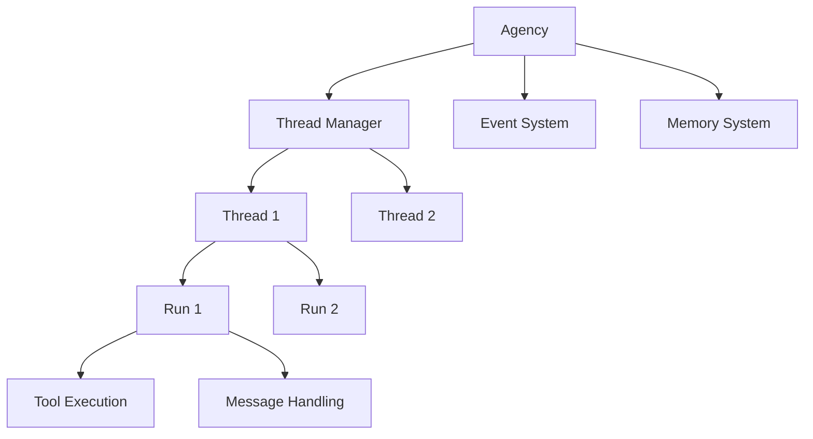

# Agency System

The Agency system is the core orchestration layer in Bedrock Swarm, managing multi-agent communication, thread coordination, and event tracking. It provides a robust framework for building complex agent-based systems.

## Class Documentation

::: bedrock_swarm.agency.agency.Agency
    options:
      show_root_heading: false
      show_source: true
      heading_level: 3

## Core Components

The agency system consists of three main components:

1. **Agency**: Central orchestration system
   - Agent management
   - Thread coordination
   - Event tracking
   - Memory management

2. **Thread**: Execution context manager
   - Run lifecycle
   - Tool execution
   - Message handling
   - State management

3. **Run**: Individual execution unit
   - State tracking
   - Action management
   - Error handling
   - Resource management

## System Architecture



## Usage Examples

```python
from bedrock_swarm.agency import Agency
from bedrock_swarm.agents import BedrockAgent
from bedrock_swarm.tools import CalculatorTool, TimeTool

# Create agents
calculator = BedrockAgent(
    name="calculator",
    model_id="us.anthropic.claude-3-5-sonnet-20241022-v2:0",
    tools=[CalculatorTool()],
    system_prompt="You are a specialist that handles calculations."
)

time_expert = BedrockAgent(
    name="time_expert",
    model_id="us.anthropic.claude-3-5-sonnet-20241022-v2:0",
    tools=[TimeTool()],
    system_prompt="You are a specialist that handles time operations."
)

# Create agency
agency = Agency(
    agents={
        "calculator": calculator,
        "time_expert": time_expert
    }
)

# Process requests
response = agency.process_request(
    message="What is 15 * 7?",
    agent_name="calculator"
)
print(response)

# Get completions
response = agency.get_completion(
    message="What time is it in Tokyo?",
    recipient_agent=time_expert,
    thread_id="thread_123"
)
print(response)
```

## Agent Communication

The agency facilitates inter-agent communication:

1. **Direct Messages**:
   ```python
   # Send message from one agent to another
   agency.send_message(
       sender="agent_a",
       recipient="agent_b",
       message="Hello!"
   )
   ```

2. **Broadcast Messages**:
   ```python
   # Send message to all agents
   agency.broadcast_message(
       sender="system",
       message="System update in 5 minutes"
   )
   ```

3. **Message Routing**:
   ```python
   # Route message based on content
   agency.route_message(
       message="Calculate 2+2",
       routing_rules={"math": "calculator"}
   )
   ```

## Thread Management

The agency manages thread lifecycle:

1. **Thread Creation**:
   ```python
   thread = agency.create_thread(
       agent_name="calculator",
       thread_id="calc_thread"
   )
   ```

2. **Thread Monitoring**:
   ```python
   status = agency.get_thread_status("calc_thread")
   print(status)  # Shows thread state and progress
   ```

3. **Thread Control**:
   ```python
   agency.pause_thread("calc_thread")
   agency.resume_thread("calc_thread")
   agency.stop_thread("calc_thread")
   ```

## Event Handling

The agency provides comprehensive event tracking:

1. **Event Recording**:
   ```python
   agency.record_event(
       type="agent_start",
       agent_name="calculator",
       details={"task": "multiplication"}
   )
   ```

2. **Event Monitoring**:
   ```python
   events = agency.get_events(
       agent_name="calculator",
       event_type="tool_call"
   )
   ```

3. **Event Analysis**:
   ```python
   metrics = agency.analyze_events(
       timeframe="1h",
       metrics=["success_rate", "latency"]
   )
   ```

## Memory Management

The agency includes a shared memory system:

1. **Memory Storage**:
   ```python
   agency.store_memory(
       key="calculation_result",
       value={"result": 42}
   )
   ```

2. **Memory Retrieval**:
   ```python
   value = agency.get_memory("calculation_result")
   print(value)  # Shows stored value
   ```

3. **Memory Cleanup**:
   ```python
   agency.clear_memory("calculation_result")
   agency.clear_all_memories()
   ```

## Best Practices

1. **Agent Organization**:
   ```python
   # Group related agents
   math_agents = {
       "calculator": calculator,
       "statistician": statistician
   }

   # Create specialized agency
   math_agency = Agency(agents=math_agents)
   ```

2. **Thread Management**:
   ```python
   # Reuse threads for related operations
   thread_id = f"{agent_name}_{operation_type}"
   response = agency.process_request(
       message=request,
       agent_name=agent_name,
       thread_id=thread_id
   )
   ```

3. **Error Handling**:
   ```python
   try:
       response = agency.process_request(
           message=request,
           agent_name=agent_name
       )
   except AgencyError as e:
       logger.error(f"Agency error: {e}")
       # Handle error appropriately
   ```
