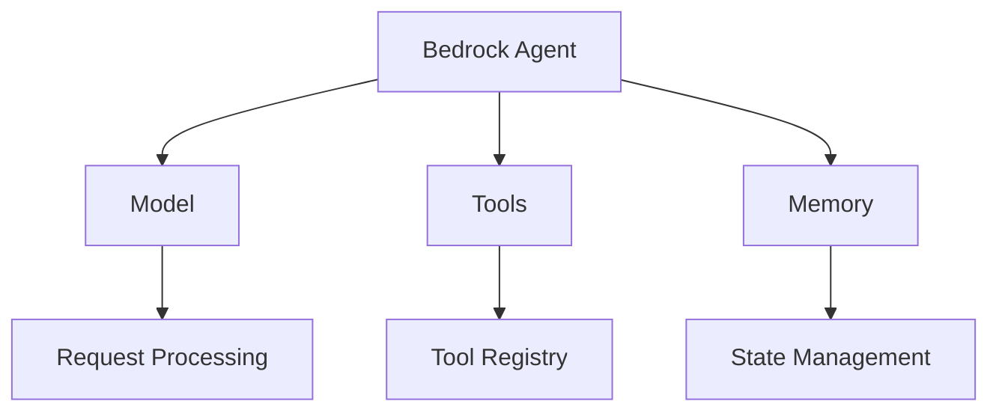

# Agents

Agents are the core building blocks of the Bedrock Swarm framework. Each agent is a specialized entity that can process requests, use tools, and interact with other agents through the agency system.

For detailed API documentation of the `BedrockAgent` class, see [Base Agent](../agents/base.md).

## Agent Architecture

The agent system follows a modular design:



## Core Components

1. **Bedrock Agent**
   - Request processing
   - Tool management
   - Memory handling
   - State tracking

2. **Model Integration**
   - Model selection
   - Prompt management
   - Response processing
   - Token tracking

3. **Tool System**
   - Tool registration
   - Tool validation
   - Execution handling
   - Result processing

## Agent Configuration

Configure agents with specific capabilities:

```python
from bedrock_swarm.agents import BedrockAgent
from bedrock_swarm.tools import CalculatorTool, SearchTool

# Create specialized agent
agent = BedrockAgent(
    name="research_assistant",
    model_id="us.anthropic.claude-3-5-sonnet-20241022-v2:0",
    tools=[
        CalculatorTool(),
        SearchTool()
    ],
    system_prompt="You are a research assistant...",
    config={
        "temperature": 0.7,
        "max_tokens": 4096
    }
)
```

## Tool Integration

Agents can use various tools:

1. **Built-in Tools**
   - Calculator
   - Search
   - File operations
   - Data processing

2. **Custom Tools**
   - API integration
   - Database access
   - External services
   - Specialized functions

## Memory Management

Agents maintain state through:

1. **Short-term Memory**
   - Conversation context
   - Recent interactions
   - Tool results
   - Temporary data

2. **Long-term Memory**
   - Persistent state
   - Learning outcomes
   - Configuration
   - Historical data

## Best Practices

1. **Agent Design**
   - Single responsibility
   - Clear objectives
   - Proper error handling
   - Resource efficiency

2. **Tool Usage**
   - Appropriate selection
   - Error handling
   - Result validation
   - Resource management

3. **Memory Usage**
   - Context management
   - State cleanup
   - Data persistence
   - Memory limits

## See Also

- [Agency Overview](index.md)
- [Thread Documentation](thread.md)
- [Event System](events.md)
