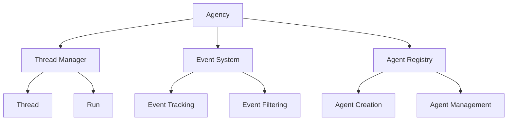

# Agency

The Agency module is the core orchestration layer of the Bedrock Swarm framework. It manages communication between agents, coordinates task execution, and handles resource allocation.

## Overview

The Agency system consists of several key components:



## Core Components

1. **Agency**
   - Central coordination point
   - Manages agent communication
   - Handles resource allocation
   - Coordinates task execution

2. **Thread Manager**
   - Manages conversation threads
   - Handles parallel execution
   - Coordinates agent interactions
   - Tracks conversation state

3. **Event System**
   - Records agent activities
   - Tracks system operations
   - Enables event filtering
   - Supports debugging

4. **Agent Registry**
   - Manages agent lifecycle
   - Handles agent creation
   - Tracks agent state
   - Coordinates resources

## Key Features

1. **Agent Communication**
   - Direct messaging
   - Broadcast capabilities
   - Event notifications
   - State synchronization

2. **Resource Management**
   - Memory allocation
   - Model token tracking
   - Concurrent operations
   - Load balancing

3. **Task Coordination**
   - Sequential execution
   - Parallel processing
   - Priority handling
   - Error recovery

## Usage Examples

```python
from bedrock_swarm.agency import Agency
from bedrock_swarm.agents import BedrockAgent

# Create agency instance
agency = Agency()

# Add agents
calculator = BedrockAgent(
    name="calculator",
    model_id="us.anthropic.claude-3-5-sonnet-20241022-v2:0",
    tools=[CalculatorTool()]
)
agency.add_agent(calculator)

# Process request
response = agency.process_request(
    "Calculate 2 + 2",
    agent_name="calculator"
)
```

## Best Practices

1. **Agent Organization**
   - Group related agents
   - Define clear responsibilities
   - Implement proper error handling
   - Monitor resource usage

2. **Communication Patterns**
   - Use direct messaging
   - Implement retry logic
   - Handle timeouts
   - Track message flow

3. **Resource Management**
   - Monitor token usage
   - Implement rate limiting
   - Handle concurrent requests
   - Manage memory usage

## See Also

- [Thread Documentation](thread.md)
- [Run Documentation](run.md)
- [Event System](events.md)
