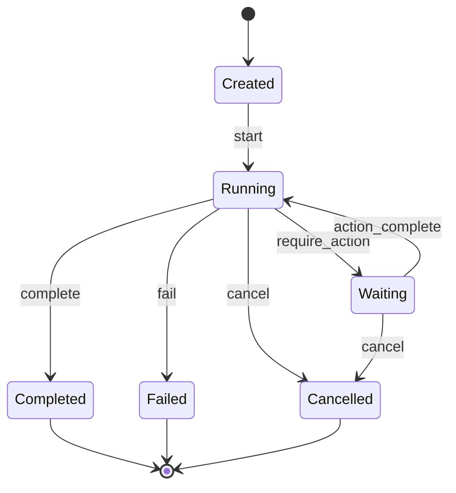

# Run Management

The Run system in Bedrock Swarm manages the lifecycle and state of individual execution runs within threads. Each run represents a single execution context with its own state, actions, and completion status.

## Class Documentation

::: bedrock_swarm.agency.thread.Run
    options:
      show_root_heading: false
      show_source: true
      heading_level: 3

## Run States

A run can be in one of these states:

1. **Created**: Initial state when run is created
2. **Running**: Run is actively executing
3. **Waiting**: Run is waiting for action
4. **Completed**: Run has successfully completed
5. **Failed**: Run has failed with error
6. **Cancelled**: Run was cancelled

## Run Lifecycle



## Usage Examples

```python
from bedrock_swarm.agency import Run

# Create a new run
run = Run()

# Start execution
run.start()

# Require action
run.require_action({
    "type": "tool_call",
    "tool": "calculator",
    "args": {"expression": "2 + 2"}
})

# Complete run
run.complete()

# Handle failure
run.fail("Error: Invalid operation")

# Check status
print(run.status)  # Output: "completed" or "failed"
```

## Run Actions

Runs can require different types of actions:

1. **Tool Calls**:
   ```python
   run.require_action({
       "type": "tool_call",
       "tool": "tool_name",
       "args": {"param": "value"}
   })
   ```

2. **Message Actions**:
   ```python
   run.require_action({
       "type": "send_message",
       "recipient": "agent_name",
       "content": "message"
   })
   ```

3. **System Actions**:
   ```python
   run.require_action({
       "type": "system_action",
       "action": "pause",
       "duration": 5
   })
   ```

## Error Handling

The run system handles various error scenarios:

1. **State Transitions**:
   ```python
   try:
       run.complete()  # When not in running state
   except InvalidStateError:
       print("Cannot complete run in current state")
   ```

2. **Action Validation**:
   ```python
   try:
       run.require_action(invalid_action)
   except ValidationError:
       print("Invalid action format")
   ```

3. **Failure Handling**:
   ```python
   try:
       # Run operation
       result = perform_operation()
   except Exception as e:
       run.fail(str(e))
   ```

## Implementation Details

The run implementation includes:

1. **State Management**:
   - State validation
   - Transition rules
   - History tracking

2. **Action Handling**:
   - Action validation
   - Action queueing
   - Action completion

3. **Resource Management**:
   - Resource allocation
   - Resource cleanup
   - Memory management

## Run Configuration

Runs can be configured with:

```python
run_config = {
    "timeout": 300,  # Maximum run duration
    "retry": {
        "max_attempts": 3,
        "delay": 1.0
    },
    "resources": {
        "memory": "1GB",
        "cpu": 2
    }
}
```

## Best Practices

1. **State Management**:
   ```python
   # Always check state before operations
   if run.can_complete():
       run.complete()
   else:
       print(f"Cannot complete in state: {run.status}")
   ```

2. **Error Handling**:
   ```python
   try:
       # Run operations
       result = perform_operations()
       run.complete()
   except Exception as e:
       run.fail(str(e))
   finally:
       cleanup_resources()
   ```

3. **Action Management**:
   ```python
   # Record action requirement
   action_id = run.require_action(action)

   # Complete action
   run.complete_action(action_id, result)

   # Handle action failure
   run.fail_action(action_id, error)
   ```
