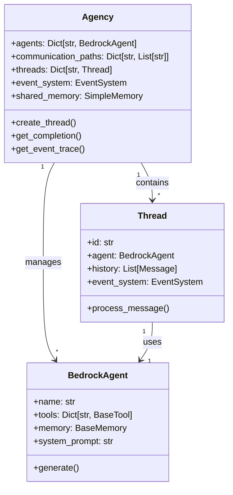
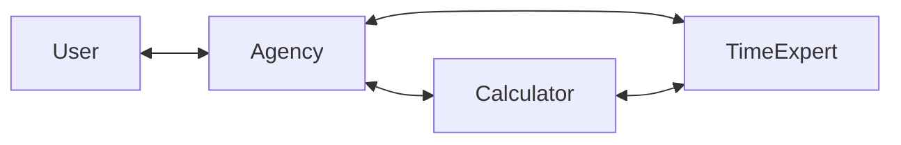

# Understanding the Agency

The Agency is the central orchestrator in Bedrock Swarm that manages communication between agents and coordinates their activities. Think of it as a virtual office where AI agents work together to solve problems.

## Agency Architecture



## Key Components

### 1. Agents

Each agent in the agency:
- Has specific capabilities and tools
- Can communicate with other agents
- Maintains its own memory and context
- Processes requests independently

```python
# Create an agent with specific capabilities
calculator = BedrockAgent(
    name="calculator",
    model_id="us.anthropic.claude-3-5-sonnet-20241022-v2:0",
    tools=[CalculatorTool()]
)

# Add to agency
agency = Agency(agents=[calculator])
```

### 2. Communication Paths

The Agency manages communication between agents:



### 3. Message Processing

When a message comes in:
1. Agency routes to appropriate agent
2. Agent processes the request
3. Uses tools or communicates with other agents if needed
4. Returns response to user

```python
# Example of message processing
response = agency.process_request(
    "What is 15 * 7?",
    agent_name="calculator"
)
```

## Creating an Agency

### Basic Setup

```python
from bedrock_swarm.agency import Agency
from bedrock_swarm.agents import BedrockAgent
from bedrock_swarm.memory import SimpleMemory

# Create agents
calculator = BedrockAgent(
    name="calculator",
    model_id="us.anthropic.claude-3-5-sonnet-20241022-v2:0",
    tools=[CalculatorTool()]
)

time_expert = BedrockAgent(
    name="time_expert",
    model_id="us.anthropic.claude-3-5-sonnet-20241022-v2:0",
    tools=[TimezoneTool()]
)

# Create agency
agency = Agency(
    agents=[calculator, time_expert],
    shared_memory=SimpleMemory(),  # Optional
    shared_instructions="Work together to solve tasks"  # Optional
)
```

### Advanced Configuration

Configure complex communication patterns:

```python
# Create agency with specific communication paths
agency = Agency(
    agents=[calculator, time_expert],
    communication_paths={
        "calculator": ["time_expert"],  # Calculator can talk to Time Expert
        "time_expert": ["calculator"]   # Time Expert can talk to Calculator
    },
    shared_memory=shared_memory
)
```

## Best Practices

1. **Agent Design**
   - Create focused agents with clear responsibilities
   - Provide specific system prompts
   - Equip with relevant tools only

2. **Communication Flow**
   - Define clear communication paths
   - Use shared memory for common information
   - Keep agent interactions focused

3. **Error Handling**
   - Monitor the event trace for issues
   - Set up proper error handling in tools
   - Use the event system to track task completion

## Event Tracing

The Agency provides detailed event tracing:

```python
# Get a trace of all events
trace = agency.get_event_trace()
print(trace)

# Sample output:
# [12:16:17.929] RUN_START - Agent: calculator
#   message: Calculate 15 * 7
# [12:16:20.780] TOOL_START - Agent: calculator
#   tool_name: CalculatorTool
#   arguments: {"x": 15, "y": 7}
# ...
```

## Common Patterns

### 1. Task Decomposition
```python
# Complex query handling
response = agency.process_request(
    "If it's 3:00 PM in New York, and a meeting lasts 2.5 hours, "
    "what time will it end in Tokyo?",
    agent_name="time_expert"
)
```

### 2. Shared Context
```python
# Using shared memory for context
agency.shared_memory.shared_state.set("meeting_duration", "2.5 hours")
agency.shared_memory.shared_state.set("timezone_from", "America/New_York")
```

### 3. Multi-Step Tasks
```python
# Create a dedicated thread for multi-step tasks
thread = agency.create_thread(agent_name="time_expert")
thread.process_message("Step 1: Calculate the time difference")
thread.process_message("Step 2: Add the duration")
```
