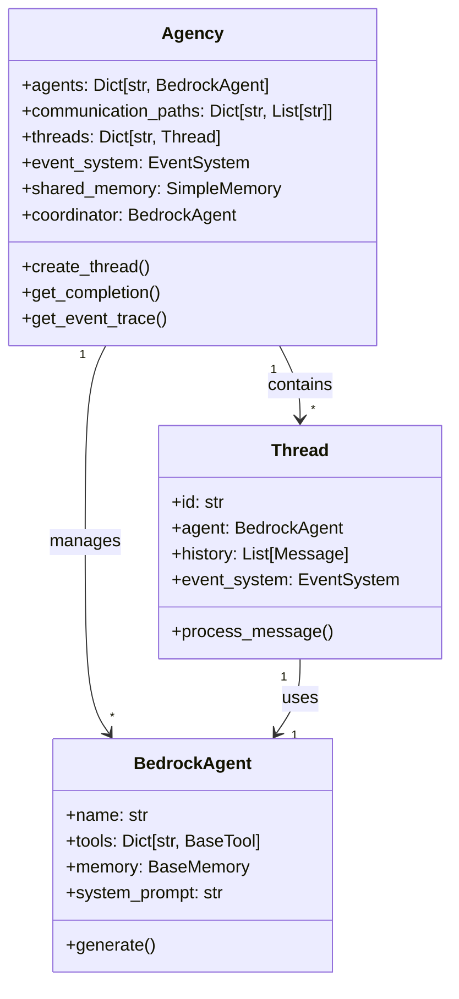
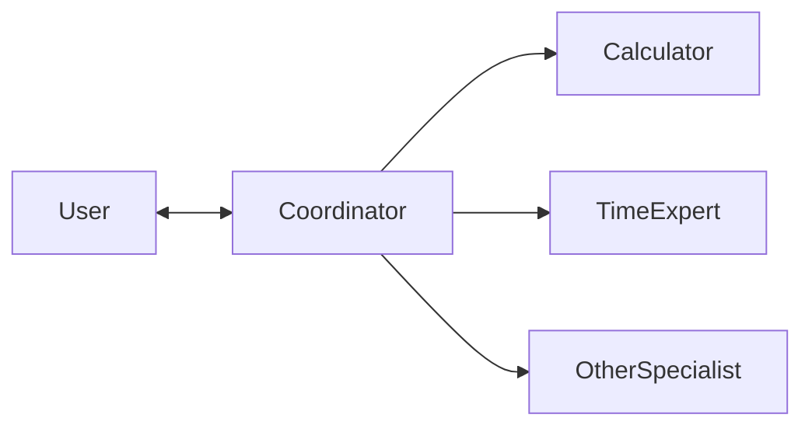

# Understanding the Agency

The Agency is the central orchestrator in Bedrock Swarm that manages communication between agents and coordinates their activities. Think of it as a virtual office where specialized AI agents work together to solve problems.

## Agency Architecture



## Key Components

### 1. Coordinator Agent

Every Agency automatically creates a coordinator agent that:
- Acts as the main interface with users
- Routes requests to appropriate specialists
- Manages complex tasks requiring multiple agents

```python
agency = Agency(specialists=[calculator, time_expert])
# Coordinator is automatically created and configured
```

### 2. Communication Paths

The Agency manages who can talk to whom through communication paths:



### 3. Message Routing

When a message comes in:
1. The coordinator receives it first
2. Analyzes the task requirements
3. Routes to appropriate specialists using the SendMessage tool
4. Combines responses if needed

```python
# Example of how a message flows
response = agency.get_completion("What is 15 * 7?")
# 1. Coordinator receives query
# 2. Recognizes it's a calculation
# 3. Routes to calculator agent
# 4. Returns formatted response
```

## Creating an Agency

### Basic Setup

```python
from bedrock_swarm.agency.agency import Agency
from bedrock_swarm.agents.base import BedrockAgent
from bedrock_swarm.memory.base import SimpleMemory

# Create specialists
calculator = BedrockAgent(
    name="calculator",
    model_id="us.anthropic.claude-3-5-sonnet-20241022-v2:0",
    tools=[CalculatorTool()]
)

# Create agency
agency = Agency(
    specialists=[calculator],
    shared_memory=SimpleMemory(),  # Optional
    shared_instructions="Work together to solve tasks"  # Optional
)
```

### Advanced Configuration

You can configure more complex communication patterns:

```python
# Create agency with specific communication paths
agency = Agency(
    agency_chart=[
        coordinator,  # Can talk to user
        [coordinator, time_expert],  # Coordinator can talk to Time Expert
        [coordinator, calculator],   # Coordinator can talk to Calculator
    ],
    shared_memory=shared_memory
)
```

## Best Practices

1. **Specialist Design**
   - Create focused specialists with clear responsibilities
   - Provide specific system prompts
   - Equip with relevant tools only

2. **Communication Flow**
   - Keep the coordinator as the main routing point
   - Avoid creating direct communication between specialists
   - Use shared memory for information that multiple agents need

3. **Error Handling**
   - Monitor the event trace for issues
   - Set up proper error handling in tools
   - Use the event system to track task completion

## Event Tracing

The Agency provides detailed event tracing:

```python
# Get a trace of all events
trace = agency.get_event_trace()
print(trace)

# Sample output:
# [12:16:17.929] RUN_START - Agent: coordinator
#   message: What is 15 * 7?
# [12:16:20.780] TOOL_START - Agent: coordinator
#   tool_name: SendMessage
#   arguments: {"recipient": "calculator", "message": "Calculate 15 * 7"}
# ...
```

## Common Patterns

### 1. Task Decomposition
```python
# Complex query handling
response = agency.get_completion(
    "If it's 3:00 PM in New York, and a meeting lasts 2.5 hours, "
    "what time will it end in Tokyo?"
)
# Coordinator breaks this into:
# 1. Get current time conversion (time_expert)
# 2. Calculate duration (calculator)
# 3. Get final time (time_expert)
```

### 2. Shared Context
```python
# Using shared memory for context
agency.shared_memory.shared_state.set("meeting_duration", "2.5 hours")
agency.shared_memory.shared_state.set("timezone_from", "America/New_York")
```

### 3. Multi-Step Tasks
```python
# Create a dedicated thread for multi-step tasks
thread = agency.create_thread()
thread.process_message("Step 1: Calculate the time difference")
thread.process_message("Step 2: Add the duration")
```
