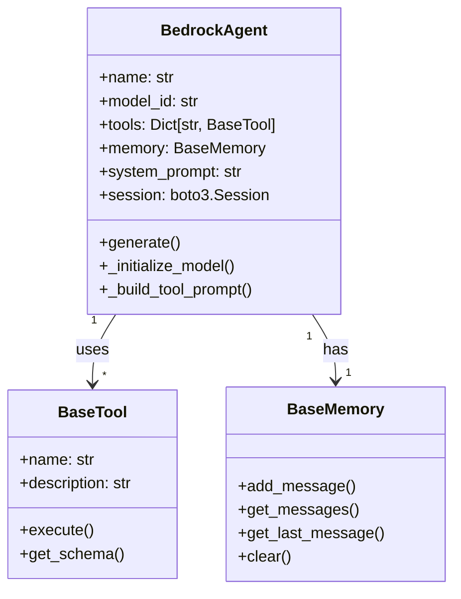
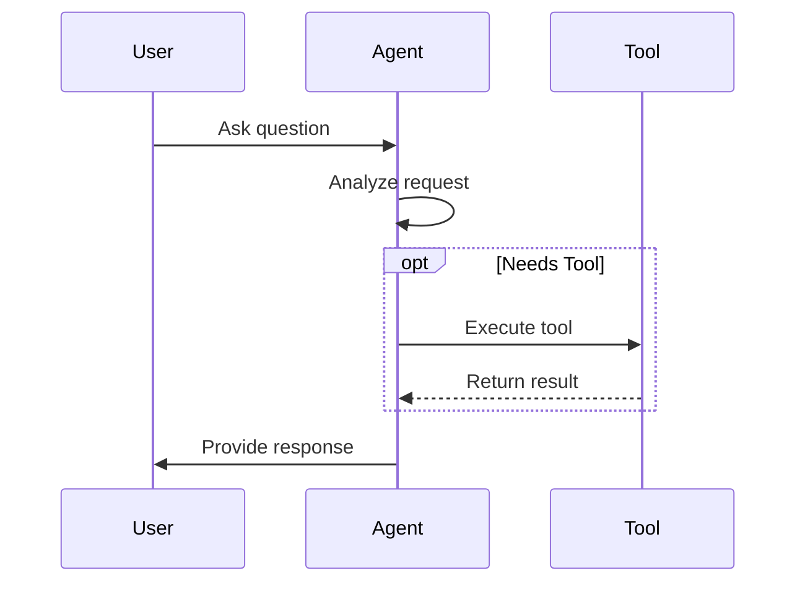

# Working with Agents

Agents are the core building blocks of Bedrock Swarm. Each agent is a specialized AI assistant powered by Amazon Bedrock's foundation models, equipped with specific tools and capabilities.

## Agent Architecture



## Creating Agents

### Basic Agent Creation

```python
from bedrock_swarm.agents.base import BedrockAgent
from bedrock_swarm.tools.calculator import CalculatorTool

# Create a simple calculator agent
calculator = BedrockAgent(
    name="calculator",  # Optional but recommended
    model_id="us.anthropic.claude-3-5-sonnet-20241022-v2:0",
    tools=[CalculatorTool()],
    system_prompt="You are a specialist that handles calculations."
)
```

### Specialized Agent Types

```python
# Time expert agent
time_expert = BedrockAgent(
    name="time_expert",
    model_id="us.anthropic.claude-3-5-sonnet-20241022-v2:0",
    tools=[CurrentTimeTool()],
    system_prompt="""You are a time zone specialist. You can:
    - Convert between time zones
    - Tell current time in any location
    - Calculate time differences"""
)

# Research agent
research_agent = BedrockAgent(
    name="researcher",
    model_id="us.anthropic.claude-3-5-sonnet-20241022-v2:0",
    tools=[SearchTool(), BrowseTool()],
    system_prompt="You are a research specialist that finds and summarizes information."
)
```

## Agent Components

### 1. Model Integration

Agents use Amazon Bedrock's foundation models:

```python
# Available models
models = [
    "us.anthropic.claude-3-5-sonnet-20241022-v2:0",  # Claude 3.5 Sonnet
    "us.anthropic.claude-3-haiku-20240307-v1:0",     # Claude 3 Haiku
    # Add other models as they become available
]

# Model configuration
agent = BedrockAgent(
    model_id="us.anthropic.claude-3-5-sonnet-20241022-v2:0",
    # Model-specific settings can be configured
)
```

### 2. Tools

Agents can be equipped with various tools:

```python
from bedrock_swarm.tools.base import BaseTool

# Create a custom tool
class CustomTool(BaseTool):
    def __init__(self):
        self._name = "custom_tool"
        self._description = "Does something specific"

    def _execute_impl(self, **kwargs):
        # Tool implementation
        return "result"

# Add tools to agent
agent = BedrockAgent(
    tools=[
        CalculatorTool(),
        CurrentTimeTool(),
        CustomTool()
    ]
)
```

### 3. Memory

Agents can have their own memory or share memory:

```python
from bedrock_swarm.memory.base import SimpleMemory

# Create memory system
memory = SimpleMemory(max_size=1000)

# Agent with memory
agent = BedrockAgent(
    memory=memory,
    # Other settings...
)

# Add information to memory
memory.add_message(Message(
    role="user",
    content="Remember this information",
    timestamp=datetime.now()
))
```

## Agent Behavior

### 1. Message Processing

Agents process messages through threads, which manage the conversation flow:

```python
from bedrock_swarm.agency import Agency, Thread
from bedrock_swarm.agents import BedrockAgent

# Create an agent
agent = BedrockAgent(
    name="calculator",
    model_id="us.anthropic.claude-3-5-sonnet-20241022-v2:0",
    tools=[CalculatorTool()]
)

# Create agency
agency = Agency(agents=[agent])

# Process request - agency manages thread creation
response = agency.process_request("What is 2 + 2?", agent_name="calculator")

# The agency will:
# 1. Create or reuse a thread for this agent
# 2. Process the message through the thread
# 3. Handle tool executions if needed
# 4. Return the final response
```

Threads provide:
- Conversation history tracking
- Tool execution management
- Event recording
- Error handling
- Context maintenance

### 2. Tool Usage

Agents automatically determine when to use tools:



### 3. Error Handling

```python
try:
    response = agent.generate("Complex query")
except ModelInvokeError as e:
    print(f"Model error: {e}")
except ToolError as e:
    print(f"Tool error: {e}")
```

## Best Practices

1. **Specialization**
   ```python
   # Good: Focused specialist
   calculator = BedrockAgent(
       tools=[CalculatorTool()],
       system_prompt="You handle calculations only."
   )

   # Bad: Too broad
   agent = BedrockAgent(
       tools=[CalculatorTool(), SearchTool(), TimeTool()],
       system_prompt="You do many things."
   )
   ```

2. **System Prompts**
   ```python
   # Good: Clear, specific instructions
   system_prompt = """You are a time zone specialist.
   Always:
   1. Verify the timezone exists
   2. Use the CurrentTimeTool for accurate times
   3. Format times in a clear, consistent way"""

   # Bad: Vague instructions
   system_prompt = "You help with time zones"
   ```

3. **Tool Selection**
   ```python
   # Good: Related, complementary tools
   research_tools = [
       SearchTool(),
       BrowseTool(),
       SummarizeTool()
   ]

   # Bad: Unrelated tools
   mixed_tools = [
       SearchTool(),
       CalculatorTool(),
       WeatherTool()
   ]
   ```

## Advanced Usage

### 1. Custom Model Configuration

```python
agent = BedrockAgent(
    model_id="us.anthropic.claude-3-5-sonnet-20241022-v2:0",
    model_kwargs={
        "temperature": 0.7,
        "max_tokens": 4096
    }
)
```

### 2. Chaining Agents

```python
# Create specialized agents
researcher = BedrockAgent(tools=[SearchTool()])
summarizer = BedrockAgent(tools=[SummarizeTool()])

# Chain their operations
search_result = researcher.generate("Find information about X")
summary = summarizer.generate(f"Summarize this: {search_result}")
```

### 3. Event Monitoring

```python
# Track agent activities
agent.event_system.create_event(
    type="custom_event",
    agent_name=agent.name,
    details={"action": "special_task"}
)

# Get agent's event history
events = agent.event_system.get_events(
    agent_name=agent.name
)
```
