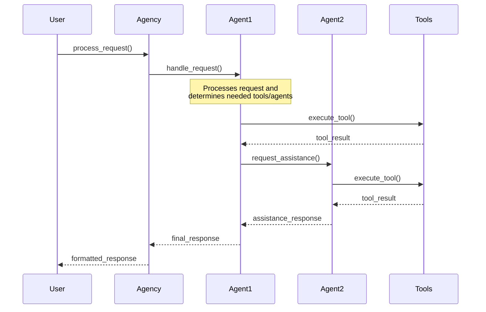

# Architecture

The Bedrock Swarm is a framework for building multi-agent systems using Amazon Bedrock. It provides a flexible architecture that enables direct agent-to-agent communication and tool execution.

## Core Components

### Agency
The central orchestrator that:
- Manages communication between agents
- Handles request processing
- Manages shared memory and event tracing
- Coordinates tool execution and responses

### Agents
Autonomous agents that:
- Process user requests directly
- Execute tools within their capabilities
- Communicate with other agents as needed
- Maintain their own context and memory

### Tools
Reusable components that:
- Provide specific functionality to agents
- Handle input validation and processing
- Return structured outputs
- Can be shared across agents

## Communication Flow



## Request Processing Flow

1. **Request Handling**
   - User sends request to Agency
   - Agency routes to appropriate agent
   - Agent processes request and determines actions

2. **Execution Phase**
   - Agent executes necessary tools
   - Communicates with other agents if needed
   - Maintains context through memory system
   - Events are traced for debugging

3. **Response Phase**
   - Agent formulates response
   - Agency formats and returns to user

## Memory and State Management

The system uses a flexible memory system that allows:
- Per-agent memory storage
- Shared memory across agents
- Persistent context maintenance
- Event history tracking

## Event Tracing

The Agency includes comprehensive event tracing:

```
[timestamp] request_received - Agency
[timestamp] agent_processing - Agent: agent1
[timestamp] tool_execution - Agent: agent1, Tool: calculator
[timestamp] agent_communication - From: agent1, To: agent2
[timestamp] response_complete - Agency
```

## Best Practices

1. **Agent Design**
   - Define clear agent responsibilities
   - Implement proper error handling
   - Use appropriate memory management
   - Document agent capabilities

2. **Tool Implementation**
   - Validate inputs thoroughly
   - Return structured outputs
   - Include helpful error messages
   - Document expected behavior

3. **Memory Management**
   - Use appropriate memory types
   - Clean up unused memory
   - Handle memory conflicts
   - Document memory patterns
