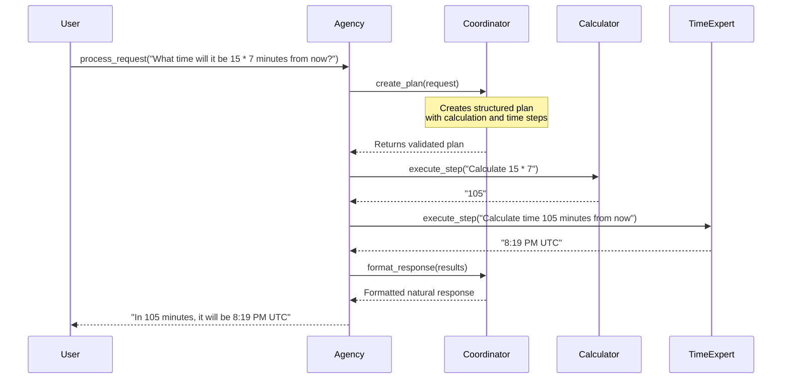

# Architecture

The Bedrock Swarm uses a coordinator-based architecture to manage communication between specialized agents. This design allows for complex tasks to be broken down into smaller steps and executed by the most appropriate specialists.

## Core Components

### Agency
The central orchestrator that:
- Manages communication between agents
- Creates and maintains the coordinator agent
- Handles request processing and plan execution
- Manages shared memory and event tracing

### Coordinator
A specialized agent that:
- Receives user requests
- Creates structured execution plans
- Delegates tasks to appropriate specialists
- Formats final responses

### Specialists
Domain-specific agents that:
- Handle specific types of tasks (e.g., calculations, time operations)
- Execute tools within their domain
- Return results to the coordinator

## Communication Flow



## Request Processing Flow

1. **Plan Creation Phase**
   - User sends request to Agency
   - Agency forwards to Coordinator
   - Coordinator creates structured plan using `create_plan` tool
   - Plan is validated and stored

2. **Execution Phase**
   - Agency executes each step in sequence
   - Specialists are called with their specific tasks
   - Results are collected and dependencies managed
   - Events are traced for debugging

3. **Response Formatting Phase**
   - Results are sent back to Coordinator
   - Coordinator formats natural response
   - Final response returned to user

## Example Plan Structure

```json
{
  "steps": [
    {
      "step_number": 1,
      "description": "Calculate 15 * 7",
      "specialist": "calculator"
    },
    {
      "step_number": 2,
      "description": "Calculate the time {MINUTES} minutes from now",
      "specialist": "time_expert",
      "requires_results_from": [1]
    }
  ],
  "final_output_format": "In {MINUTES} minutes, the time will be {TIME}"
}
```

## Event Tracing

The Agency includes comprehensive event tracing to help debug and monitor the execution flow:

```
[timestamp] run_start - Agent: coordinator
[timestamp] tool_start - Agent: coordinator
[timestamp] tool_complete - Agent: coordinator
[timestamp] execution_start - Agent: agency
[timestamp] step_complete - Agent: calculator
[timestamp] step_complete - Agent: time_expert
[timestamp] execution_complete - Agent: agency
[timestamp] response_complete - Agent: agency
```

## Best Practices

1. **Specialist Design**
   - Keep specialists focused on a single domain
   - Provide clear tool descriptions
   - Handle errors gracefully

2. **Plan Creation**
   - Break complex tasks into atomic steps
   - Specify clear dependencies
   - Use descriptive step descriptions

3. **Tool Implementation**
   - Validate inputs thoroughly
   - Return clear, structured outputs
   - Include helpful error messages 