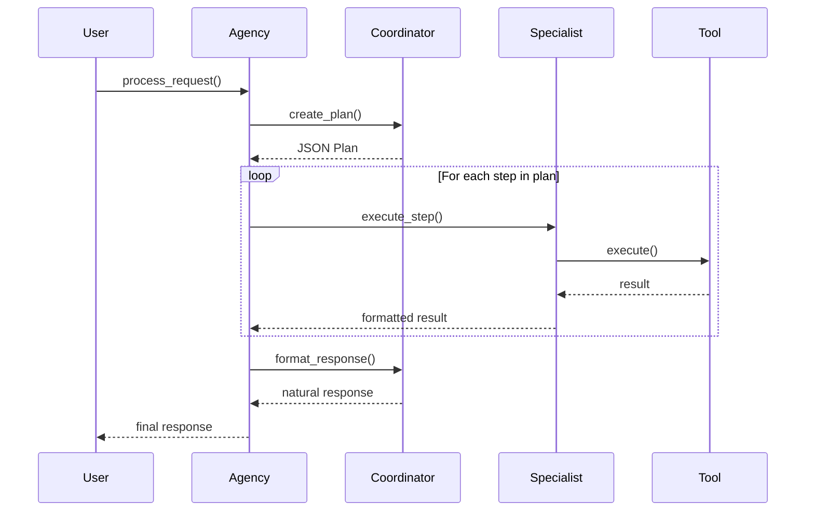
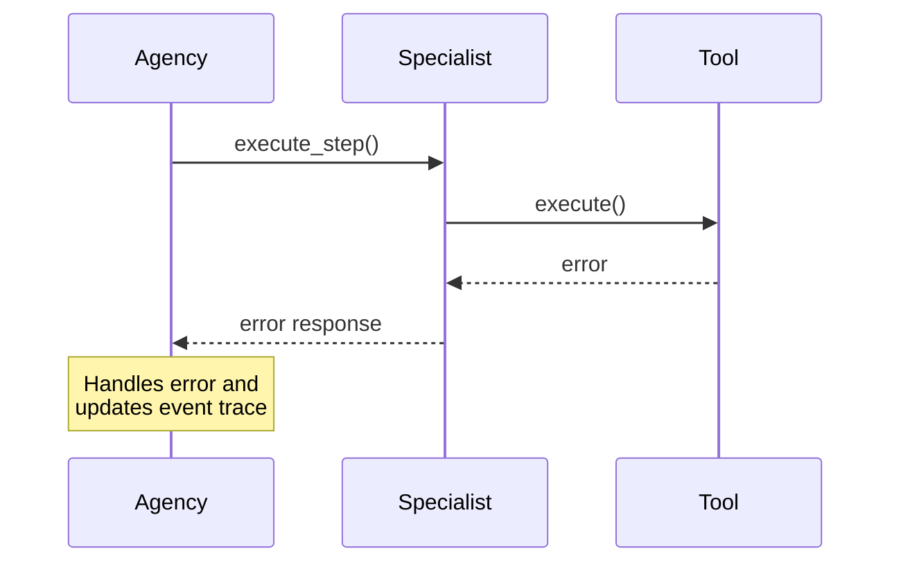

# Communication Flow

The Bedrock Swarm uses a structured communication flow to handle requests and coordinate between agents. This document explains the detailed communication patterns and how different components interact.

## Basic Flow



## Detailed Communication Steps

### 1. Request Initiation
When a user sends a request:
```python
response = agency.process_request("What time will it be 15 * 7 minutes from now?")
```

The Agency:
1. Creates a new run in the main thread
2. Forwards request to Coordinator
3. Initializes event tracing

### 2. Plan Creation
The Coordinator:
1. Analyzes the request
2. Identifies required specialists
3. Creates a structured JSON plan:
```json
{
  "steps": [
    {
      "step_number": 1,
      "description": "Calculate 15 * 7",
      "specialist": "calculator"
    },
    {
      "step_number": 2,
      "description": "Calculate time {MINUTES} minutes from now",
      "specialist": "time_expert",
      "requires_results_from": [1]
    }
  ],
  "final_output_format": "In {MINUTES} minutes, it will be {TIME}"
}
```

### 3. Step Execution
For each step, the Agency:
1. Identifies the required specialist
2. Prepares the context with any dependencies
3. Sends the task to the specialist
4. Collects and stores the result

### 4. Tool Usage
Specialists:
1. Receive their specific tasks
2. Use their tools to perform operations
3. Format results for the Agency

### 5. Response Formatting
Finally:
1. All results are collected
2. Coordinator formats a natural response
3. Response is returned to the user

## Event System Integration

Every communication step generates events:

```
[timestamp] run_start - Agent: coordinator
  message: "Original user request"

[timestamp] tool_start - Agent: coordinator
  tool_name: create_plan
  arguments: {...}

[timestamp] tool_complete - Agent: coordinator
  result: "Approved plan"

[timestamp] step_complete - Agent: calculator
  result: "105"

[timestamp] step_complete - Agent: time_expert
  result: "8:19 PM UTC"

[timestamp] response_complete - Agent: agency
  response: "Final formatted response"
```

## Communication Patterns

### Sequential Execution
- Steps are executed in order
- Dependencies are respected
- Results are passed between steps

### Error Handling


### Memory Integration
- Results are stored in shared memory
- Context is maintained across steps
- Dependencies can access previous results

## Best Practices

1. **Request Design**
   - Make requests clear and specific
   - Include all necessary information
   - Consider potential dependencies

2. **Plan Structure**
   - Break complex tasks into atomic steps
   - Specify clear dependencies
   - Use descriptive step descriptions

3. **Error Handling**
   - Implement proper error handling
   - Provide clear error messages
   - Consider fallback options

4. **Event Tracing**
   - Enable event tracing for debugging
   - Monitor communication flow
   - Track execution times
