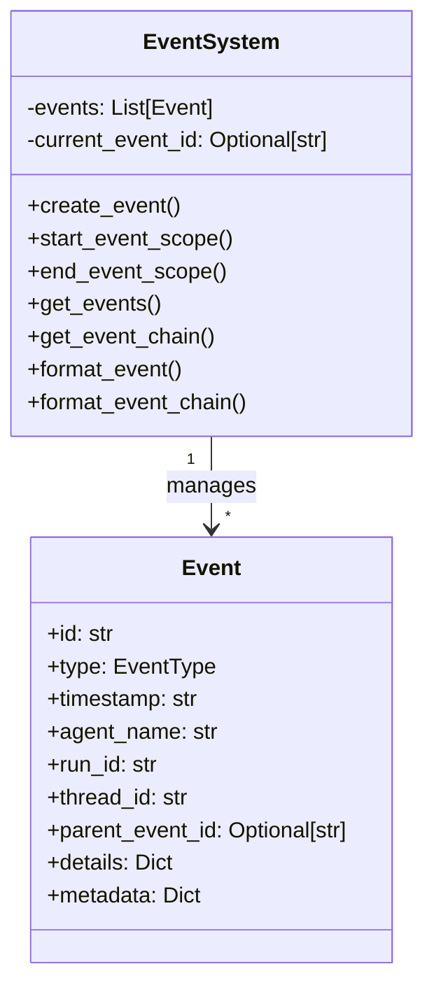

# Event System

The Event System in Bedrock Swarm provides detailed tracking and monitoring of all interactions within the agent swarm. It captures agent activities, tool executions, message passing, and more in a structured, traceable format.

## Event System Architecture



## Event Types

```python
from typing import Literal

EventType = Literal[
    "agent_start",           # Agent begins processing
    "agent_complete",        # Agent completes processing
    "tool_start",           # Tool execution begins
    "tool_complete",        # Tool execution completes
    "message_sent",         # Message sent between agents
    "message_received",     # Message received by agent
    "error",               # Error occurred
    "run_start",           # Run begins
    "run_complete"         # Run completes
]
```

## Creating Events

### 1. Basic Event Creation

```python
from bedrock_swarm.events import EventSystem

# Initialize event system
event_system = EventSystem()

# Create an event
event_id = event_system.create_event(
    type="agent_start",
    agent_name="calculator",
    run_id="run_123",
    thread_id="thread_456",
    details={
        "message": "Calculate 15 * 7"
    }
)
```

### 2. Event Scopes

```python
# Start event scope
event_system.start_event_scope(event_id)

try:
    # Child events will have this as parent
    child_id = event_system.create_event(
        type="tool_start",
        agent_name="calculator",
        run_id="run_123",
        thread_id="thread_456",
        details={"tool": "calculator"}
    )
finally:
    # Always end the scope
    event_system.end_event_scope()
```

## Event Querying

### 1. Filtering Events

```python
# Get all events for a run
run_events = event_system.get_events(run_id="run_123")

# Get events by type
tool_events = event_system.get_events(event_type="tool_complete")

# Get events for specific agent
agent_events = event_system.get_events(agent_name="calculator")

# Combine filters
specific_events = event_system.get_events(
    run_id="run_123",
    thread_id="thread_456",
    agent_name="calculator",
    event_type="tool_complete"
)
```

### 2. Event Chains

```python
# Get chain of events leading to specific event
chain = event_system.get_event_chain(event_id)

# Format chain for display
formatted_chain = event_system.format_event_chain(event_id)
print(formatted_chain)
```

## Event Integration

### 1. With Agency

```python
# Agency automatically creates events
agency = Agency(specialists=[calculator, time_expert])

# Get event trace
trace = agency.get_event_trace()
print(trace)

# Sample output:
# [12:16:17.929] RUN_START - Agent: coordinator
#   message: What is 15 * 7?
# [12:16:20.780] TOOL_START - Agent: coordinator
#   tool_name: SendMessage
#   arguments: {"recipient": "calculator", "message": "Calculate 15 * 7"}
```

### 2. With Threads

```python
# Thread events
thread = Thread(agent=calculator)
thread.event_system = event_system

response = thread.process_message("Calculate 15 * 7")
# Events are automatically created for:
# - Run start/complete
# - Agent start/complete
# - Tool executions
```

### 3. With Tools

```python
# Tool execution events
calculator = CalculatorTool()
thread.event_system.create_event(
    type="tool_start",
    agent_name="calculator",
    run_id="run_123",
    thread_id="thread_456",
    details={
        "tool_name": calculator.name,
        "arguments": {"expression": "15 * 7"}
    }
)
```

## Event Analysis

### 1. Event Statistics

```python
class EventAnalytics:
    def __init__(self, event_system: EventSystem):
        self.events = event_system

    def get_run_stats(self, run_id: str) -> Dict[str, Any]:
        run_events = self.events.get_events(run_id=run_id)

        return {
            "total_events": len(run_events),
            "tool_executions": len([
                e for e in run_events
                if e["type"] == "tool_complete"
            ]),
            "errors": len([
                e for e in run_events
                if e["type"] == "error"
            ]),
            "duration": self._calculate_duration(run_events)
        }

    def _calculate_duration(self, events: List[Event]) -> float:
        if not events:
            return 0.0

        start = min(e["timestamp"] for e in events)
        end = max(e["timestamp"] for e in events)

        return (
            datetime.fromisoformat(end) -
            datetime.fromisoformat(start)
        ).total_seconds()
```

### 2. Event Visualization

```python
class EventVisualizer:
    def __init__(self, event_system: EventSystem):
        self.events = event_system

    def generate_timeline(self, run_id: str) -> str:
        events = self.events.get_events(run_id=run_id)
        timeline = []

        for event in events:
            time = datetime.fromisoformat(
                event["timestamp"]
            ).strftime("%H:%M:%S")

            timeline.append(
                f"{time} | {event['type']} | "
                f"{event['agent_name']} | "
                f"{self._format_details(event['details'])}"
            )

        return "\n".join(timeline)

    def _format_details(self, details: Dict) -> str:
        return " | ".join(f"{k}: {v}" for k, v in details.items())
```

## Best Practices

### 1. Event Creation

```python
# Good: Detailed event
event_system.create_event(
    type="tool_start",
    agent_name="calculator",
    run_id="run_123",
    thread_id="thread_456",
    details={
        "tool_name": "calculator",
        "expression": "15 * 7",
        "context": "User calculation request"
    }
)

# Bad: Missing context
event_system.create_event(
    type="tool_start",
    agent_name="calculator",
    run_id="run_123",
    thread_id="thread_456",
    details={"tool": "calculator"}
)
```

### 2. Scope Management

```python
# Good: Proper scope handling
event_id = event_system.create_event(...)
event_system.start_event_scope(event_id)
try:
    # Do work
    pass
finally:
    event_system.end_event_scope()

# Bad: Forgotten scope end
event_id = event_system.create_event(...)
event_system.start_event_scope(event_id)
# Do work
# Missing end_event_scope()
```

### 3. Error Events

```python
try:
    result = calculator.execute(expression="15 * 7")
except Exception as e:
    event_system.create_event(
        type="error",
        agent_name="calculator",
        run_id="run_123",
        thread_id="thread_456",
        details={
            "error_type": type(e).__name__,
            "error_message": str(e),
            "context": "Calculator execution"
        }
    )
    raise
```
