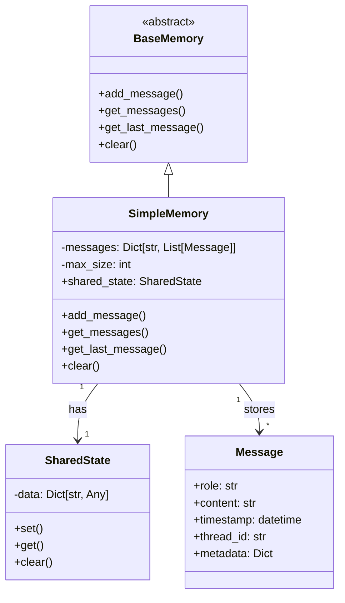

# Memory Systems

Memory in Bedrock Swarm allows agents to retain information across interactions and share context between different components of the system. The memory system manages both conversation history and shared state.

## Memory Architecture



## Memory Components

### 1. Messages

```python
from datetime import datetime
from bedrock_swarm.memory.base import Message

# Create a message
message = Message(
    role="user",
    content="Remember this information",
    timestamp=datetime.now(),
    thread_id="thread_123",
    metadata={
        "importance": "high",
        "category": "instruction"
    }
)
```

### 2. Simple Memory

```python
from bedrock_swarm.memory.base import SimpleMemory

# Create memory system
memory = SimpleMemory(max_size=1000)

# Add messages
memory.add_message(message)

# Get messages
all_messages = memory.get_messages()
thread_messages = memory.get_messages(thread_id="thread_123")
last_message = memory.get_last_message()
```

### 3. Shared State

```python
# Access shared state
memory.shared_state.set("last_calculation", "105")
value = memory.shared_state.get("last_calculation")

# Clear state
memory.shared_state.clear()
```

## Memory Usage Patterns

### 1. Thread-Specific Memory

```python
# Create thread with memory
thread = Thread(
    agent=agent,
    memory=SimpleMemory()
)

# Access thread memory
history = thread.get_history()
context = thread.get_context_window(n=5)
```

### 2. Shared Agency Memory

```python
# Create shared memory for agency
shared_memory = SimpleMemory()

# Create agency with shared memory
agency = Agency(
    specialists=[calculator, time_expert],
    shared_memory=shared_memory
)

# Access shared memory
all_messages = agency.get_memory().get_messages()
```

### 3. Memory-Aware Agents

```python
# Create agent with memory
agent = BedrockAgent(
    model_id="us.anthropic.claude-3-5-sonnet-20241022-v2:0",
    memory=SimpleMemory(),
    system_prompt="Use memory to maintain context"
)

# Agent can access its memory
last_msg = agent.memory.get_last_message()
```

## Best Practices

### 1. Memory Organization

```python
# Good: Organized by thread
memory.add_message(Message(
    role="user",
    content="Query about time",
    thread_id="time_thread"
))

memory.add_message(Message(
    role="user",
    content="Query about math",
    thread_id="math_thread"
))

# Bad: Mixed messages without thread IDs
memory.add_message(Message(
    role="user",
    content="Mixed query"
))
```

### 2. Metadata Usage

```python
# Good: Rich metadata
message = Message(
    content="Calculate result",
    metadata={
        "timestamp": datetime.now().isoformat(),
        "category": "calculation",
        "priority": "high",
        "related_thread": "math_123"
    }
)

# Bad: Missing important context
message = Message(
    content="Calculate result"
    # No metadata
)
```

### 3. State Management

```python
# Good: Structured state
memory.shared_state.set("calculation", {
    "input": "15 * 7",
    "result": "105",
    "timestamp": datetime.now().isoformat()
})

# Bad: Unstructured state
memory.shared_state.set("last_number", "105")
```

## Advanced Usage

### 1. Custom Memory Implementation

```python
from typing import List, Optional
from bedrock_swarm.memory.base import BaseMemory, Message

class PrioritizedMemory(BaseMemory):
    def __init__(self) -> None:
        self.high_priority: List[Message] = []
        self.low_priority: List[Message] = []

    def add_message(self, message: Message) -> None:
        priority = message.metadata.get("priority", "low")
        if priority == "high":
            self.high_priority.append(message)
        else:
            self.low_priority.append(message)

    def get_messages(
        self,
        thread_id: Optional[str] = None
    ) -> List[Message]:
        messages = self.high_priority + self.low_priority
        if thread_id:
            return [m for m in messages if m.thread_id == thread_id]
        return messages
```

### 2. Memory Filtering

```python
class MemoryFilter:
    def __init__(self, memory: SimpleMemory):
        self.memory = memory

    def get_by_category(self, category: str) -> List[Message]:
        return [
            msg for msg in self.memory.get_messages()
            if msg.metadata.get("category") == category
        ]

    def get_by_timerange(
        self,
        start: datetime,
        end: datetime
    ) -> List[Message]:
        return [
            msg for msg in self.memory.get_messages()
            if start <= msg.timestamp <= end
        ]
```

### 3. Memory Analytics

```python
class MemoryAnalytics:
    def __init__(self, memory: SimpleMemory):
        self.memory = memory

    def get_thread_stats(self) -> Dict[str, Dict]:
        stats = {}
        for msg in self.memory.get_messages():
            thread_id = msg.thread_id or "default"
            if thread_id not in stats:
                stats[thread_id] = {
                    "message_count": 0,
                    "roles": set(),
                    "first_message": msg.timestamp,
                    "last_message": msg.timestamp
                }

            stats[thread_id]["message_count"] += 1
            stats[thread_id]["roles"].add(msg.role)
            stats[thread_id]["last_message"] = max(
                stats[thread_id]["last_message"],
                msg.timestamp
            )

        return stats
```

### 4. Memory Persistence

```python
import json
from datetime import datetime

class PersistentMemory(SimpleMemory):
    def save_to_file(self, filename: str) -> None:
        data = {
            "messages": [
                {
                    "role": msg.role,
                    "content": msg.content,
                    "timestamp": msg.timestamp.isoformat(),
                    "thread_id": msg.thread_id,
                    "metadata": msg.metadata
                }
                for msg in self.get_messages()
            ],
            "shared_state": self.shared_state._data
        }

        with open(filename, 'w') as f:
            json.dump(data, f)

    @classmethod
    def load_from_file(cls, filename: str) -> 'PersistentMemory':
        memory = cls()

        with open(filename, 'r') as f:
            data = json.load(f)

        # Restore messages
        for msg_data in data["messages"]:
            memory.add_message(Message(
                role=msg_data["role"],
                content=msg_data["content"],
                timestamp=datetime.fromisoformat(
                    msg_data["timestamp"]
                ),
                thread_id=msg_data["thread_id"],
                metadata=msg_data["metadata"]
            ))

        # Restore shared state
        memory.shared_state._data = data["shared_state"]

        return memory
```
