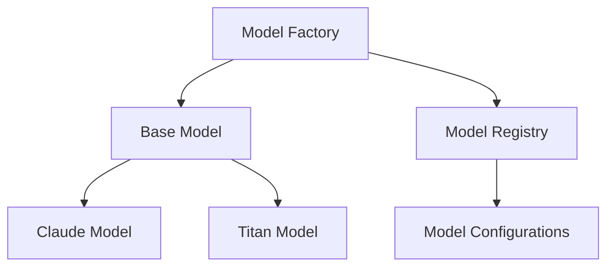

# Models

Models in Bedrock Swarm provide the foundation for agent intelligence through integration with Amazon Bedrock's language models. This document explains the core concepts and architecture of the model system.

## Model Architecture

The model system follows a layered architecture:



## Core Components

1. **Model Factory**
   - Central point for model creation
   - Handles model registration
   - Manages configurations
   - Provides model validation

2. **Base Model**
   - Abstract interface for all models
   - Defines common operations
   - Handles token management
   - Provides error handling

3. **Model Implementations**
   - Claude Model (Anthropic)
   - Titan Model (Amazon)
   - Custom model implementations

## Model Registry

The model registry maintains configurations for supported models:

```python
BEDROCK_MODEL_REGISTRY = {
    "us.anthropic.claude-3-5-sonnet": {
        "20241022-v2:0": {
            "class": ClaudeModel,
            "config": {
                "max_tokens": 200000,
                "default_tokens": 4096,
            },
        }
    },
    "amazon.titan-text-express": {
        "v1": {
            "class": TitanModel,
            "config": {
                "max_tokens": 8000,
                "default_tokens": 2048,
            },
        }
    }
}
```

## Model Operations

Models support these core operations:

1. **Request Formatting**
   - System prompt integration
   - Message formatting
   - Parameter validation
   - Token counting

2. **Response Processing**
   - Content extraction
   - Stream handling
   - Error processing
   - Token tracking

3. **Error Handling**
   - Token limit validation
   - API error handling
   - Response parsing
   - Retry logic

## Model Selection

Choose models based on these factors:

1. **Capabilities**
   - Context window size
   - Response quality
   - Specialized features
   - Performance characteristics

2. **Resource Requirements**
   - Token usage
   - Response time
   - Cost considerations
   - Memory usage

3. **Integration Needs**
   - API compatibility
   - Tool support
   - Stream processing
   - Error handling

## Best Practices

1. **Model Configuration**
   ```python
   # Use model factory for creation
   model = ModelFactory.create_model(
       "us.anthropic.claude-3-5-sonnet-20241022-v2:0"
   )

   # Configure model parameters
   model.set_config({
       "max_tokens": 100000,
       "temperature": 0.7
   })
   ```

2. **Token Management**
   ```python
   # Validate token count
   token_count = model.validate_token_count(
       max_tokens=5000
   )

   # Track token usage
   response = model.invoke(message)
   used_tokens = model.last_token_count
   ```

3. **Error Handling**
   ```python
   try:
       response = model.invoke(message)
   except ModelInvokeError as e:
       # Handle API errors
       logger.error(f"Model error: {e}")
   except TokenLimitError as e:
       # Handle token limit errors
       logger.error(f"Token limit exceeded: {e}")
   ```

## Model Integration

Integrate models with agents:

```python
from bedrock_swarm.agents import BedrockAgent
from bedrock_swarm.models.factory import ModelFactory

# Create agent with model
agent = BedrockAgent(
    name="calculator",
    model_id="us.anthropic.claude-3-5-sonnet-20241022-v2:0",
    tools=[CalculatorTool()],
    system_prompt="You are a calculation specialist."
)

# Model is automatically created and configured
response = agent.process_message("Calculate 2 + 2")
```

## See Also

- [Model API Reference](../api/models/index.md)
- [Agency Documentation](../api/agency.md)
- [Agent Documentation](agents.md)
