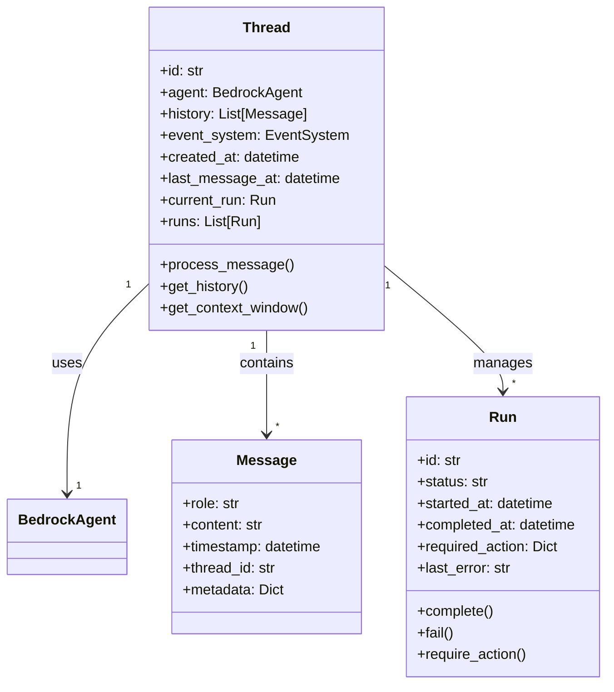
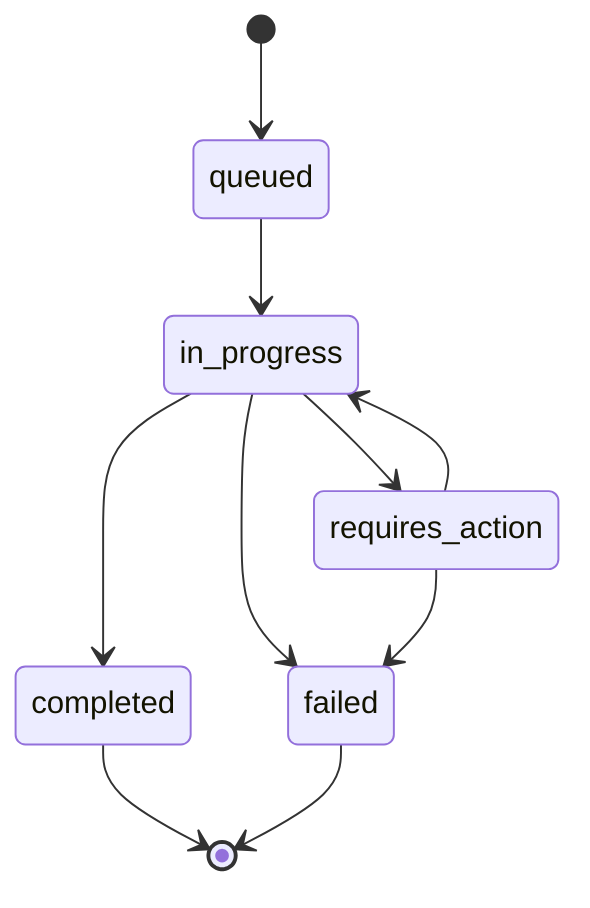
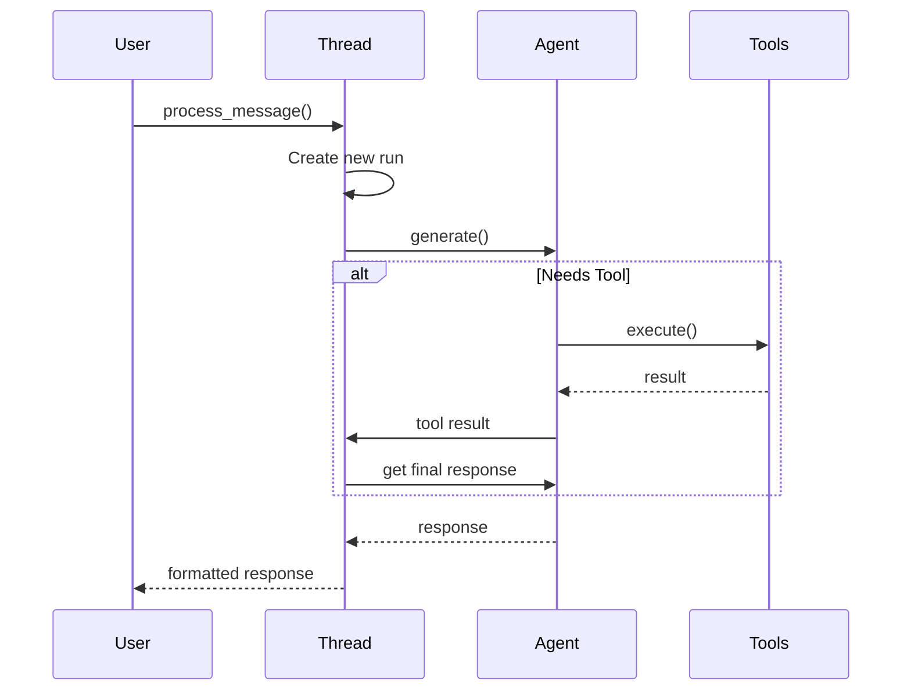

# Managing Threads

Threads in Bedrock Swarm represent individual conversation flows between users and agents. They manage message history, handle tool executions, and track the state of interactions.

## Thread Architecture



## Creating Threads

### Basic Thread Creation

```python
from bedrock_swarm.agency.thread import Thread
from bedrock_swarm.agents.base import BedrockAgent

# Create agent
agent = BedrockAgent(
    model_id="us.anthropic.claude-3-5-sonnet-20241022-v2:0",
    tools=[CalculatorTool()]
)

# Create thread
thread = Thread(agent=agent)

# Process messages
response = thread.process_message("What is 2 + 2?")
print(response)
```

### Through Agency

```python
# Create agency
agency = Agency(specialists=[calculator, time_expert])

# Create new thread
thread = agency.create_thread()

# Or get existing thread
thread = agency.get_thread(thread_id)
```

## Thread Components

### 1. Message History

```python
# Get all messages
history = thread.get_history()

# Get recent context
context = thread.get_context_window(n=5)

# Get last message
last_msg = thread.get_last_message()
```

### 2. Runs

Each message processing creates a new run:



### 3. Event System

```python
# Events are automatically created
thread.event_system.create_event(
    type="custom_event",
    agent_name=thread.agent.name,
    run_id=thread.current_run.id,
    thread_id=thread.id,
    details={"action": "special_task"}
)
```

## Thread Behavior

### 1. Message Processing Flow



### 2. Run Management

```python
# Get current run
run = thread.get_current_run()

# Get specific run
run = thread.get_run(run_id)

# Cancel run
thread.cancel_run(run_id)
```

### 3. Context Management

```python
# Thread maintains conversation context
thread.process_message("What is 15 * 7?")
thread.process_message("Add 10 to that result")  # Understands "that result"
```

## Best Practices

### 1. Thread Organization

```python
# Good: Separate threads for different contexts
calculation_thread = agency.create_thread("calculator")
time_thread = agency.create_thread("time_expert")

# Bad: Mixed concerns in single thread
thread.process_message("What is 2 + 2?")
thread.process_message("What time is it in Tokyo?")
```

### 2. Error Handling

```python
try:
    response = thread.process_message("Complex query")
except Exception as e:
    # Check run status
    run = thread.get_current_run()
    if run.status == "failed":
        print(f"Run failed: {run.last_error}")

    # Create error event
    thread.event_system.create_event(
        type="error",
        details={"error": str(e)}
    )
```

### 3. Memory Management

```python
# Limit context window for efficiency
context = thread.get_context_window(n=5)

# Clear old history if needed
if len(thread.history) > 1000:
    # Archive or process old messages
    pass
```

## Advanced Usage

### 1. Custom Run Handling

```python
class CustomThread(Thread):
    def process_message(self, content: str) -> str:
        # Create run with custom status
        self.current_run = Run()
        self.current_run.status = "custom_status"

        try:
            # Custom processing
            result = self._custom_process(content)
            self.current_run.complete()
            return result
        except Exception as e:
            self.current_run.fail(str(e))
            raise
```

### 2. Thread Switching

```python
# Switch agent in thread
thread.agent = new_agent

# Or through agency
agency.get_completion(
    message="Complex query",
    thread_id=thread.id,
    recipient_agent=specialist_agent
)
```

### 3. Event Monitoring

```python
# Track thread events
events = thread.event_system.get_events(
    thread_id=thread.id,
    event_type="tool_complete"
)

# Format event chain
chain = thread.event_system.format_event_chain(event_id)
```

### 4. Thread State

```python
class ThreadState:
    def __init__(self, thread: Thread):
        self.message_count = len(thread.history)
        self.last_activity = thread.last_message_at
        self.current_run_status = (
            thread.current_run.status
            if thread.current_run
            else None
        )
        self.tool_usage = self._count_tool_usage(thread)

    def _count_tool_usage(self, thread: Thread) -> Dict[str, int]:
        tool_counts = {}
        for event in thread.event_system.get_events(
            thread_id=thread.id,
            event_type="tool_complete"
        ):
            tool_name = event["details"]["tool_name"]
            tool_counts[tool_name] = tool_counts.get(tool_name, 0) + 1
        return tool_counts
```
