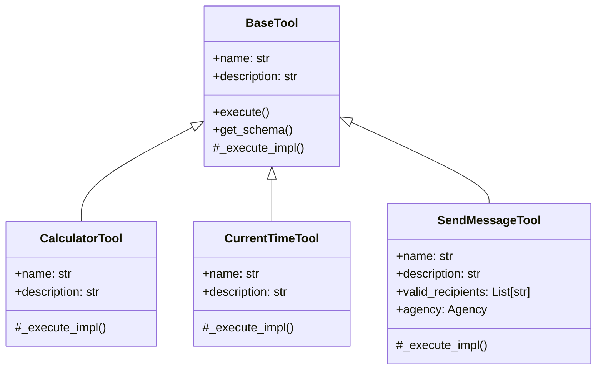
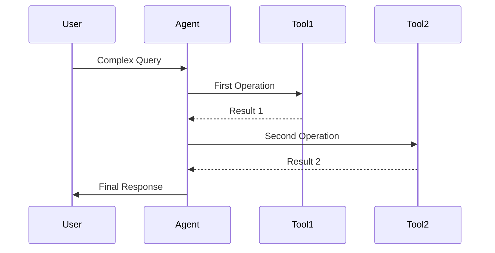

# Using Tools

Tools are functions that agents can use to perform specific tasks. They provide agents with capabilities beyond just language processing, allowing them to perform calculations, access time information, send messages between agents, and more.

## Tool Architecture



## Built-in Tools

### 1. Calculator Tool

```python
from bedrock_swarm.tools.calculator import CalculatorTool

calculator = CalculatorTool()
result = calculator.execute(expression="15 * 7")
print(result)  # "105"
```

### 2. Current Time Tool

```python
from bedrock_swarm.tools.time import CurrentTimeTool

time_tool = CurrentTimeTool()
time = time_tool.execute(timezone="Asia/Tokyo")
print(time)  # "10:30 PM JST"
```

### 3. Send Message Tool

```python
from bedrock_swarm.tools.send_message import SendMessageTool

send_tool = SendMessageTool(
    valid_recipients=["calculator", "time_expert"]
)
response = send_tool.execute(
    recipient="calculator",
    message="Calculate 15 * 7"
)
```

## Creating Custom Tools

### Basic Tool Creation

```python
from bedrock_swarm.tools.base import BaseTool
from typing import Any, Dict

class CustomTool(BaseTool):
    def __init__(
        self,
        name: str = "custom_tool",
        description: str = "Does something specific"
    ) -> None:
        self._name = name
        self._description = description

    @property
    def name(self) -> str:
        return self._name

    @property
    def description(self) -> str:
        return self._description

    def get_schema(self) -> Dict[str, Any]:
        return {
            "name": self.name,
            "description": self.description,
            "parameters": {
                "type": "object",
                "properties": {
                    "input_param": {
                        "type": "string",
                        "description": "Input parameter description"
                    }
                },
                "required": ["input_param"]
            }
        }

    def _execute_impl(self, *, input_param: str, **kwargs: Any) -> str:
        # Implement tool logic here
        return f"Processed: {input_param}"
```

### Tool with Error Handling

```python
class RobustTool(BaseTool):
    def _execute_impl(self, **kwargs: Any) -> str:
        try:
            # Tool logic here
            result = self._process(**kwargs)
            return str(result)
        except ValueError as e:
            raise ToolError(f"Invalid input: {str(e)}")
        except Exception as e:
            raise ToolExecutionError(f"Error during execution: {str(e)}")
```

## Tool Usage Patterns

### 1. Direct Usage

```python
# Create and use tool directly
calculator = CalculatorTool()
result = calculator.execute(expression="2 + 2")
```

### 2. Through Agents

```python
# Create agent with tools
agent = BedrockAgent(
    tools=[CalculatorTool(), CurrentTimeTool()],
    system_prompt="Use tools as needed"
)

# Agent automatically decides when to use tools
response = agent.generate("What is 15 * 7?")
```

### 3. Tool Chaining



## Best Practices

### 1. Tool Design

```python
# Good: Clear, single responsibility
class TimezoneTool(BaseTool):
    def _execute_impl(self, *, timezone: str) -> str:
        return get_time_in_timezone(timezone)

# Bad: Too many responsibilities
class MultiTool(BaseTool):
    def _execute_impl(self, *, action: str, data: str) -> str:
        if action == "time":
            return get_time()
        elif action == "calculate":
            return calculate(data)
        # etc...
```

### 2. Parameter Validation

```python
class ValidatedTool(BaseTool):
    def get_schema(self) -> Dict[str, Any]:
        return {
            "name": self.name,
            "description": self.description,
            "parameters": {
                "type": "object",
                "properties": {
                    "number": {
                        "type": "integer",
                        "minimum": 1,
                        "maximum": 100
                    }
                },
                "required": ["number"]
            }
        }
```

### 3. Error Messages

```python
class UserFriendlyTool(BaseTool):
    def _execute_impl(self, *, expression: str) -> str:
        try:
            # Validate input
            if not self._is_safe_expression(expression):
                raise ValueError(
                    "Invalid expression. Only use numbers and "
                    "basic operators (+, -, *, /)"
                )

            # Process
            result = eval(expression, {"__builtins__": {}})
            return str(result)

        except Exception as e:
            raise ToolError(
                f"Could not calculate '{expression}'. "
                f"Error: {str(e)}"
            )
```

## Advanced Topics

### 1. Stateful Tools

```python
class StatefulTool(BaseTool):
    def __init__(self) -> None:
        self._state = {}
        self._name = "stateful_tool"
        self._description = "Maintains state between calls"

    def _execute_impl(
        self,
        *,
        action: str,
        key: str,
        value: Optional[str] = None
    ) -> str:
        if action == "set":
            self._state[key] = value
            return f"Stored {value} at {key}"
        elif action == "get":
            return self._state.get(key, "Not found")
```

### 3. Tool Composition

```python
class ComposedTool(BaseTool):
    def __init__(self) -> None:
        self._calculator = CalculatorTool()
        self._time_tool = CurrentTimeTool()

    def _execute_impl(self, *, operation: str, **kwargs: Any) -> str:
        if operation == "calculate":
            return self._calculator.execute(**kwargs)
        elif operation == "time":
            return self._time_tool.execute(**kwargs)
```
