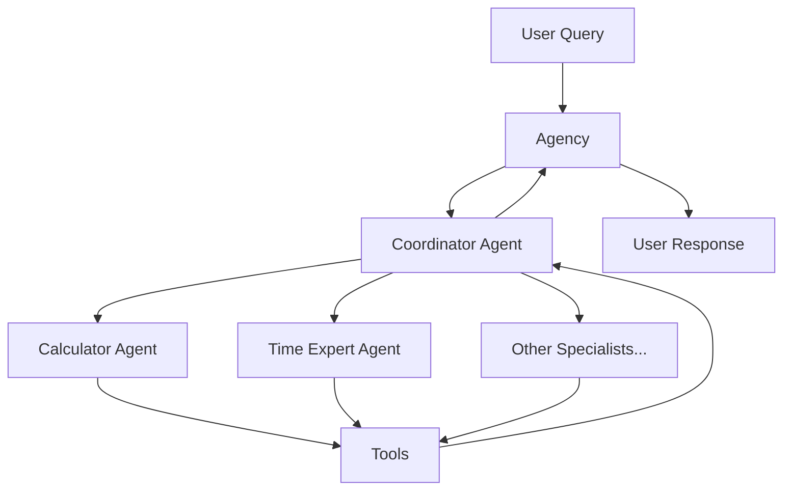

# Bedrock Swarm Documentation

Welcome to the Bedrock Swarm documentation! This library provides a powerful framework for building multi-agent systems using Amazon Bedrock's foundation models.

## What is Bedrock Swarm?

Bedrock Swarm is a Python library that enables you to create collaborative AI agent systems. It allows multiple specialized agents to work together, communicate, and solve complex tasks by breaking them down into smaller, manageable pieces.



## Key Features

- **Multi-Agent Architecture**: Create specialized agents that work together to solve complex tasks
- **Event-Driven Communication**: Track and monitor all agent interactions and tool executions
- **Built-in Tool System**: Easily extend agents with custom tools and capabilities
- **Memory Management**: Share information between agents with flexible memory systems
- **AWS Bedrock Integration**: Leverage powerful language models through Amazon Bedrock

## Quick Start

```python
from bedrock_swarm.agents.base import BedrockAgent
from bedrock_swarm.agency.agency import Agency
from bedrock_swarm.tools.calculator import CalculatorTool
from bedrock_swarm.tools.time import CurrentTimeTool

# Create specialist agents
calculator = BedrockAgent(
    name="calculator",
    model_id="us.anthropic.claude-3-5-sonnet-20241022-v2:0",
    tools=[CalculatorTool()],
    system_prompt="You are a specialist that handles calculations."
)

time_expert = BedrockAgent(
    name="time_expert",
    model_id="us.anthropic.claude-3-5-sonnet-20241022-v2:0",
    tools=[CurrentTimeTool()],
    system_prompt="You are a specialist that handles time-related queries."
)

# Create agency with specialists
agency = Agency(specialists=[calculator, time_expert])

# Get responses from the agency
response = agency.get_completion("What is 15 * 7?")
print(response)
```

## Core Concepts

1. **Agency**: The main orchestrator that manages communication between agents
2. **Agents**: Specialized AI assistants with specific capabilities
3. **Tools**: Functions that agents can use to perform specific tasks
4. **Threads**: Conversation flows between users and agents
5. **Memory**: System for storing and sharing information between agents
6. **Events**: Detailed tracking of all system interactions

## Next Steps

- [Understanding the Agency](concepts/agency.md)
- [Working with Agents](concepts/agents.md)
- [Using Tools](concepts/tools.md)
- [Managing Threads](concepts/threads.md)
- [Memory Systems](concepts/memory.md)
- [Event System](concepts/events.md)
- [Examples](examples/index.md)
