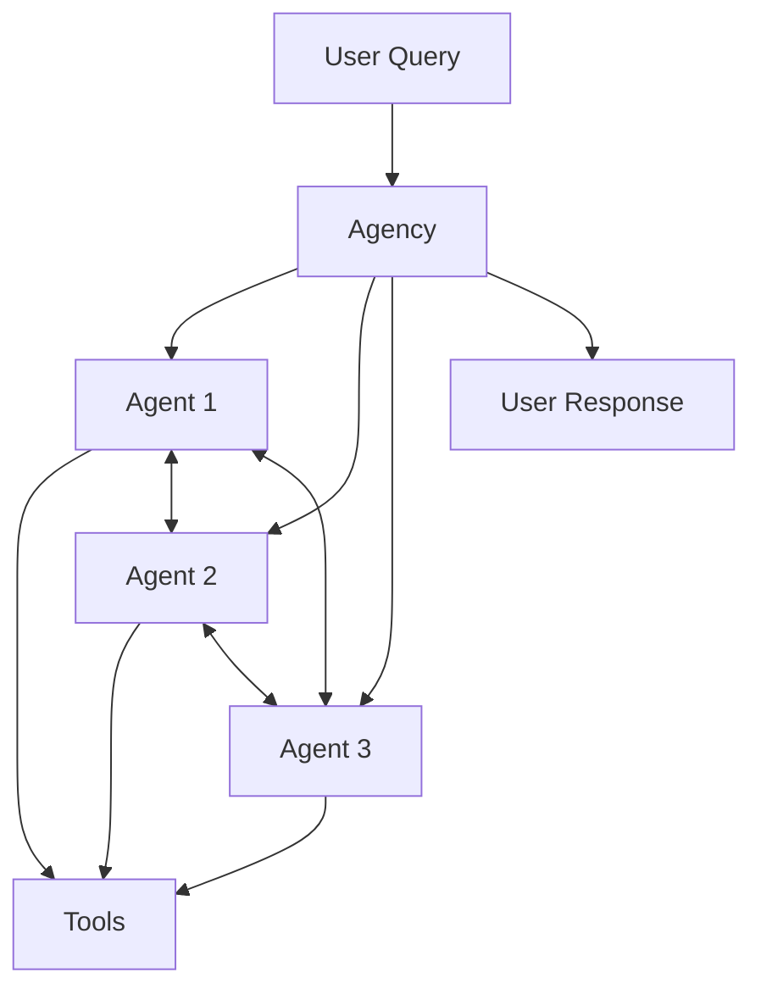

# Bedrock Agency Swarm

A framework for building multi-agent systems using Amazon Bedrock.

## Features

- **Multi-Agent Communication**: Enable direct communication between autonomous agents
- **Flexible Architecture**: Build custom agent networks for complex tasks
- **Event Tracing**: Comprehensive tracing of all agent interactions and tool executions
- **Tool Integration**: Easy integration of custom tools and capabilities
- **Memory Management**: Configurable memory systems for agent context

## Documentation

- [Architecture](concepts/architecture.md): Learn about the multi-agent design and communication flow
- [Examples](examples/index.md): See practical examples of using the framework
- [API Reference](api/index.md): Detailed API documentation

## Quick Start

1. Install the package:
```bash
pip install bedrock-agency-swarm
```

2. Set up your AWS credentials:
```bash
export AWS_PROFILE=your-profile
export AWS_REGION=your-region
```

3. Create a simple agency:
```python
from bedrock_swarm.agency import Agency
from bedrock_swarm.agents import BedrockAgent
from bedrock_swarm.tools import CalculatorTool

# Create an agent with calculator capability
calculator = BedrockAgent(
    name="calculator",
    model_id="us.anthropic.claude-3-5-sonnet-20241022-v2:0",
    tools=[CalculatorTool()],
    system_prompt="You are a mathematical specialist."
)

# Create agency with the agent
agency = Agency(agents=[calculator])

# Process a request
response = agency.process_request("What is 15 * 7?")
print(response)
```

## Contributing

Contributions are welcome! Please read our [Contributing Guide](development/contributing.md) for details on our code of conduct and the process for submitting pull requests.



## Key Features

- **Multi-Agent Architecture**: Create autonomous agents that communicate and collaborate
- **Event-Driven Communication**: Track and monitor all agent interactions and tool executions
- **Built-in Tool System**: Easily extend agents with custom tools and capabilities
- **Memory Management**: Flexible memory systems for storing agent context and shared information
- **AWS Bedrock Integration**: Leverage powerful language models through Amazon Bedrock

## Core Concepts

1. **Agency**: The main orchestrator that manages agent communication
2. **Agents**: Autonomous AI assistants with specific capabilities
3. **Tools**: Functions that agents can use to perform specific tasks
4. **Memory**: System for storing agent context and shared information
5. **Events**: Detailed tracking of all system interactions

## Next Steps

- [Understanding the Agency](concepts/agency.md)
- [Working with Agents](concepts/agents.md)
- [Using Tools](concepts/tools.md)
- [Memory Systems](concepts/memory.md)
- [Event System](concepts/events.md)
- [Examples](examples/index.md)
