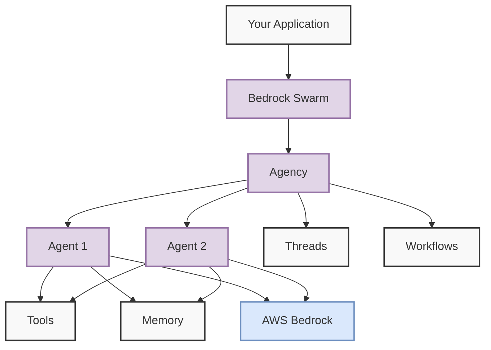
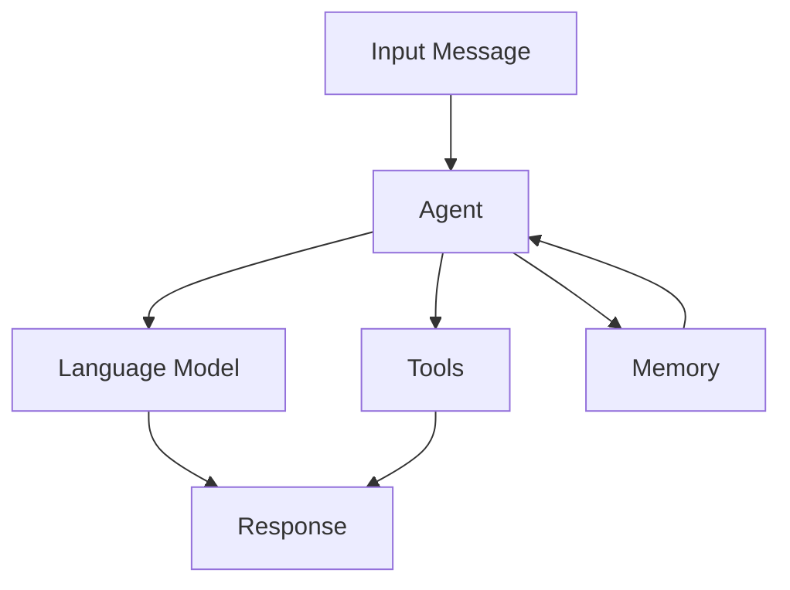
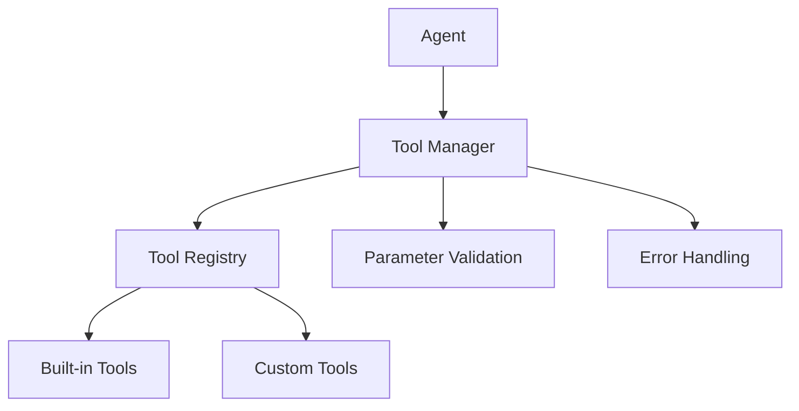
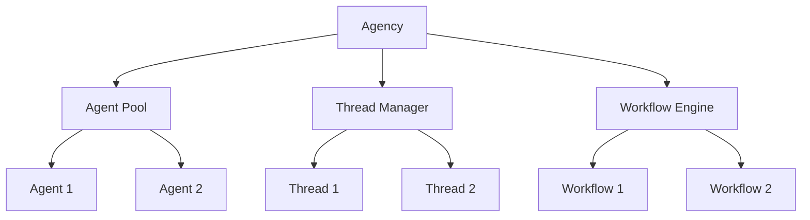

# Core Concepts

This guide explains the fundamental concepts of Bedrock Swarm and how they work together to create powerful AI applications.

## System Overview



## Key Components

### Your Application
The entry point to Bedrock Swarm. This is your code that:
- Interacts with the framework
- Creates and configures agents
- Manages workflows and conversations

### Agency
The central coordinator of the system that:
- Creates and manages agents
- Orchestrates workflows and threads
- Handles communication between components

### Agents
AI assistants managed by the Agency, equipped with:
- Dedicated tools for specific tasks
- Memory system for conversation history
- Direct access to AWS Bedrock models

### AWS Bedrock
The foundation model service providing:
- Access to multiple AI models
- Secure API endpoints
- Usage monitoring and billing
- Model version management

### Tools
Extensions that give agents additional capabilities:
- Built-in tools for common tasks
- Custom tools for specific needs
- Parameter validation and error handling

### Memory
System for maintaining conversation context:
- Message history storage
- Context management
- Configurable retention

### Workflows
Structured sequences of agent tasks that support:
- Sequential execution
- Parallel processing
- Input/output chaining

### Threads
Conversation management system enabling:
- Persistent conversations
- Multi-agent discussions
- Context preservation

## Understanding AWS Bedrock

AWS Bedrock is Amazon's foundation model service that provides:

- Access to multiple AI models (Claude, Titan, etc.)
- Secure API endpoints
- Usage monitoring and billing
- Model version management

### Available Models

Bedrock Swarm supports these model families:

1. **Anthropic Claude**
   - Best for: Complex reasoning, coding, analysis
   - Models:
     - Claude 3.5
     - Claude 2
   - Features:
     - High accuracy
     - Code understanding
     - Complex reasoning

2. **Amazon Titan**
   - Best for: General text tasks, summarization
   - Models:
     - Text Express
     - Text Lite
   - Features:
     - Cost-effective
     - Fast responses
     - General purpose

3. **AI21 Jurassic**
   - Best for: Creative writing, text generation
   - Models:
     - J2 Mid
     - J2 Ultra
   - Features:
     - Creative outputs
     - Multiple languages
     - Text generation

4. **Cohere Command**
   - Best for: Text classification, analysis
   - Models:
     - Command Text v14
   - Features:
     - Efficient processing
     - Classification tasks
     - Pattern recognition

## Agents in Detail

Agents are the core building blocks of Bedrock Swarm. Each agent is an AI assistant that can:
- Process messages using a language model
- Follow specific instructions
- Use tools to perform actions
- Maintain conversation memory

### Agent Architecture



### Creating an Agent

```python
from bedrock_swarm import BedrockAgent
from bedrock_swarm.config import AWSConfig

# Basic agent configuration
agent = BedrockAgent(
    name="helper",                   # Unique identifier
    model_id="...",                 # AWS Bedrock model
    aws_config=config,              # AWS settings
    instructions="...",             # Behavior guidelines
    temperature=0.7,                # Response creativity
    max_tokens=1000                # Response length
)

# Agent with tools
from bedrock_swarm.tools.time import CurrentTimeTool
agent.add_tool(CurrentTimeTool())

# Agent with custom instructions
agent = BedrockAgent(
    name="coding_assistant",
    model_id="us.anthropic.claude-3-5-sonnet-20241022-v2:0",
    aws_config=config,
    instructions="""You are a Python coding assistant.
    When writing code:
    1. Always include comments
    2. Follow PEP 8 style guidelines
    3. Include error handling
    4. Add type hints
    """
)
```

## Tools System

Tools extend agents' capabilities by allowing them to perform specific actions.

### Tool Architecture



### Creating Custom Tools

```python
from bedrock_swarm.tools import BaseTool
from typing import Dict, Any

class CalculatorTool(BaseTool):
    @property
    def name(self) -> str:
        return "calculator"

    @property
    def description(self) -> str:
        return "Performs basic mathematical calculations"

    def get_schema(self) -> Dict[str, Any]:
        return {
            "name": self.name,
            "description": self.description,
            "parameters": {
                "type": "object",
                "properties": {
                    "expression": {
                        "type": "string",
                        "description": "Mathematical expression to evaluate"
                    }
                },
                "required": ["expression"]
            }
        }

    def _execute_impl(self, expression: str) -> str:
        try:
            result = eval(expression)
            return str(result)
        except Exception as e:
            return f"Error: {str(e)}"
```

## Memory Systems

Memory allows agents to maintain context across conversations.

### Memory Types

1. **Simple Memory**
   - Stores messages in a list
   - Basic but efficient
   - Good for most use cases

```python
from bedrock_swarm.memory import SimpleMemory

agent = BedrockAgent(
    name="assistant",
    model_id="...",
    aws_config=config,
    memory=SimpleMemory()
)
```

2. **Vector Memory**
   - Stores message embeddings
   - Enables semantic search
   - Good for large conversations

```python
from bedrock_swarm.memory import VectorMemory

agent = BedrockAgent(
    name="assistant",
    model_id="...",
    aws_config=config,
    memory=VectorMemory()
)
```

### Message Structure

```python
@dataclass
class Message:
    role: str              # 'human', 'assistant', or 'system'
    content: str           # The message text
    timestamp: float       # When the message was sent
    tool_calls: List[Dict] # Tools used in this message
    tool_results: List[str] # Results from tool calls
    metadata: Dict         # Additional information
```

## Agency and Multi-Agent Systems

Agencies coordinate multiple agents to solve complex tasks.

### Agency Architecture



### Creating an Agency

```python
from bedrock_swarm import Agency

# Create agency
agency = Agency(
    aws_config=config,
    shared_instructions="Common instructions for all agents"
)

# Add specialized agents
agency.add_agent(
    name="researcher",
    model_id="...",
    instructions="Research specialist instructions",
    tools=[WebSearchTool()]
)

agency.add_agent(
    name="writer",
    model_id="...",
    instructions="Content writer instructions"
)

# Create a workflow
workflow = agency.create_workflow(
    name="content_creation",
    steps=[
        {
            "agent": "researcher",
            "instructions": "Research the topic",
            "tools": ["web_search"]
        },
        {
            "agent": "writer",
            "instructions": "Write content based on research",
            "input_from": ["step1"]
        }
    ]
)

# Execute workflow
results = agency.execute_workflow(
    workflow_id=workflow.id,
    input_data={"topic": "AI Safety"}
)
```

## Best Practices

### Agent Design

1. **Clear Instructions**
   ```python
   instructions = """
   Role: You are a helpful coding assistant

   Guidelines:
   1. Always write clear, commented code
   2. Include error handling
   3. Use type hints
   4. Follow PEP 8 style

   When using tools:
   1. Use web_search for current information
   2. Use calculator for computations
   """
   ```

2. **Appropriate Model Selection**
   ```python
   # For complex tasks
   model_id = "us.anthropic.claude-3-5-sonnet-20241022-v2:0"

   # For simple tasks
   model_id = "amazon.titan-text-lite-v1"
   ```

3. **Tool Management**
   ```python
   # Add only necessary tools
   agent.add_tool(WebSearchTool())
   agent.add_tool(CalculatorTool())

   # Remove unused tools
   agent.remove_tool("web_search")
   ```

### Error Handling

```python
from bedrock_swarm.exceptions import (
    ModelInvokeError,
    ToolError,
    ResponseParsingError
)

try:
    response = agent.process_message(message)
except ModelInvokeError as e:
    logger.error(f"Model error: {e}")
    # Retry with different model
except ToolError as e:
    logger.error(f"Tool error: {e}")
    # Use fallback tool
except ResponseParsingError as e:
    logger.error(f"Parsing error: {e}")
    # Request clarification
```

### Performance Optimization

1. **Token Management**
   ```python
   agent = BedrockAgent(
       max_tokens=1000,     # Limit response length
       temperature=0.7,     # Balance creativity/consistency
       top_p=0.9           # Control response diversity
   )
   ```

2. **Memory Management**
   ```python
   # Clear memory periodically
   if len(agent.memory.get_messages()) > 100:
       agent.clear_memory()

   # Use vector memory for large conversations
   agent.memory = VectorMemory(
       max_messages=1000,
       embedding_model="..."
   )
   ```

3. **Parallel Processing**
   ```python
   # Run agents in parallel
   async with agency.batch() as batch:
       task1 = batch.submit(agent1, "Task 1")
       task2 = batch.submit(agent2, "Task 2")

   results = await asyncio.gather(task1, task2)
   ```

## Next Steps

1. Try the [Basic Examples](../examples/basic.md)
2. Explore [Advanced Features](advanced.md)
3. Read the [API Reference](../api/agents.md)
4. Join our [Discord Community](https://discord.gg/bedrock-swarm)
